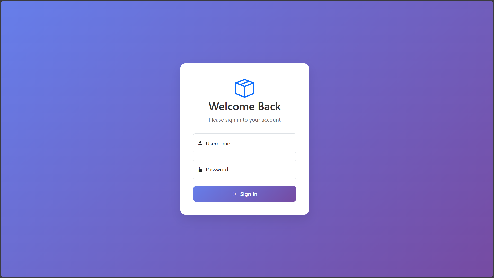
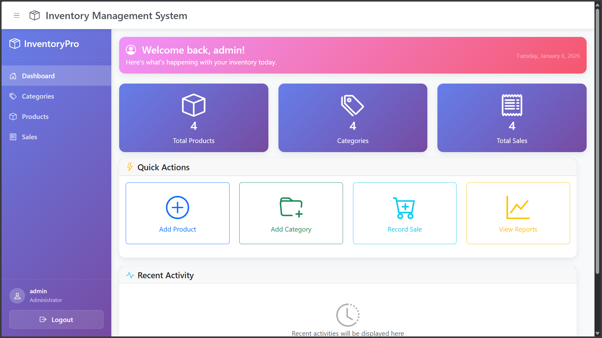
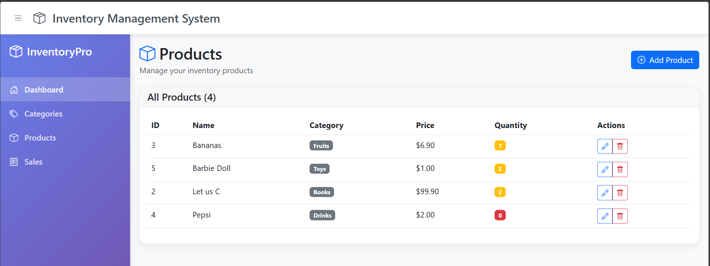
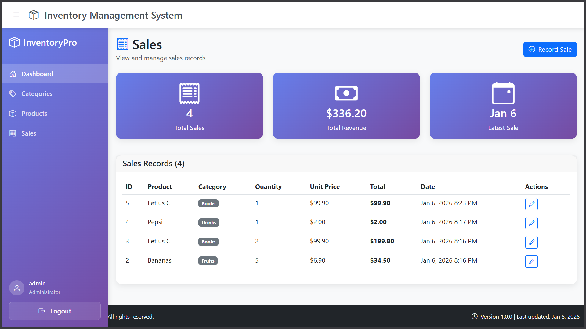

# Inventory Management System

A full-featured Inventory Management System developed using **pure PHP**, **MySQL**, **PDO**, **Bootstrap**, **CSS**, and **JavaScript**.  
The application focuses on backend correctness, security, and real-world business logic while providing a clean and responsive user interface.

---

## Overview

This system enables authenticated users to manage **categories**, **products**, and **sales** efficiently while maintaining accurate stock levels and data integrity.  
A centralized dashboard provides quick insights and shortcuts for daily operations.

The project emphasizes strong backend fundamentals such as secure authentication, prepared statements, validation, access control, and modular code organization—without relying on any PHP framework.

### Technologies Used

  
  
  
  
  

---

## Features

### Authentication & Security
- Secure login and logout using PHP sessions
- Password hashing with `password_hash()` and verification using `password_verify()`
- Centralized authentication check included via global header
- Protected routes to prevent unauthorized access

### Dashboard
- Overview dashboard showing:
  - Total categories
  - Total products
  - Total sales
- Quick actions to add categories, products, and sales

### Category Management
- Create, read, update, and delete categories
- Server-side validation with meaningful error messages
- Restriction on deleting categories linked to products

### Product Management
- Complete CRUD operations for products
- Category association using foreign keys
- Stock quantity tracking
- Validation for price, stock, and category selection

### Sales Management
- Record product sales with quantity validation
- Automatic stock deduction after successful sale
- Prevention of sales when stock is insufficient
- Sales history tracking

### UI & UX
- Responsive design using Bootstrap 5
- Custom CSS for layout and branding
- JavaScript for UI interactions
- Reusable layout using header and footer includes

---

## Project Structure

inventory-management-system/
├── auth/                # Authentication (login/logout)
├── categories/          # Category CRUD
├── products/            # Product CRUD
├── sales/               # Sales management
├── public/              # Dashboard
├── includes/            # Header, footer, auth check
├── config/              # Database configuration
├── database.sql         # Database schema
├── .gitignore
├── README.md

---

## Application Flow & Architecture

The application follows a **modular, page-based architecture** using pure PHP, where each request is handled through clearly defined scripts and shared includes.

### Request Lifecycle
1. User accesses a page (e.g., dashboard, products, sales)
2. `header.php` is included first
   - Performs authentication check
   - Loads shared layout and navigation
3. Page-specific logic executes
   - Input validation
   - Database interaction via PDO
4. Data is rendered using HTML + Bootstrap
5. `footer.php` finalizes the layout

This approach ensures:
- Consistent access control
- Minimal code duplication
- Clear separation of concerns

---

## Authentication & Authorization

- Authentication is handled using PHP sessions
- Login verifies credentials using hashed passwords
- An `auth_check.php` file is included globally to protect routes
- Unauthorized users are redirected to the login page

---

## Business Logic Enforcement

The system enforces real-world business rules at the application level:

- Categories cannot be deleted if products exist under them
- Sales cannot be recorded if product stock is insufficient
- Product stock is automatically updated after each sale
- Input data is validated before database interaction

---

## Error Handling & Validation

- Server-side validation is applied for all forms
- Meaningful error messages are displayed to users
- Database operations are wrapped in safe PDO queries
- Invalid requests are redirected gracefully
- PDO exceptions are handled safely to prevent application crashes
- Invalid requests are redirected gracefully to avoid exposing internal logic
- Defensive checks are applied before database writes

---

## Database Design

The database is designed with normalization and integrity in mind.

### Tables Overview

#### `users`
- `id` (INT, Primary Key)
- `username` (VARCHAR, Unique)
- `password` (VARCHAR)
- `created_at` (TIMESTAMP)

#### `categories`
- `id` (INT, Primary Key)
- `name` (VARCHAR, Unique)
- `created_at` (TIMESTAMP)

#### `products`
- `id` (INT, Primary Key)
- `category_id` (INT, Foreign Key)
- `name` (VARCHAR)
- `price` (DECIMAL)
- `stock` (INT)
- `created_at` (TIMESTAMP)

#### `sales`
- `id` (INT, Primary Key)
- `product_id` (INT, Foreign Key)
- `quantity` (INT)
- `total_price` (DECIMAL)
- `created_at` (TIMESTAMP)

---

## Screenshots

---

## Live Demo

---

## License

This project is licensed under the MIT License.

